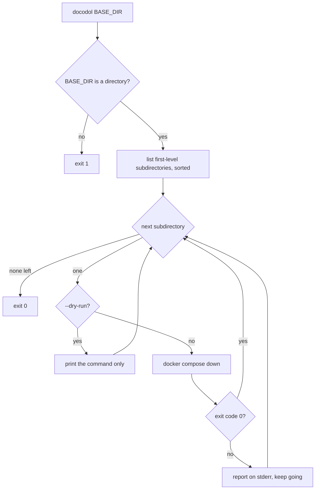

# 📦 Docker Compose Down All (docodol)

[](https://github.com/sponsors/kevinveenbirkenbach) [](https://www.patreon.com/c/kevinveenbirkenbach) [](https://buymeacoffee.com/kevinveenbirkenbach) [](https://s.veen.world/paypaldonate)

> A simple Python utility to iterate through first‑level subdirectories and run `docker compose down` in each. 🐳🔥

## 🧭 How it works



## 🚀 Installation

```bash
pip install docodol
```

pip is the single supported installation path.

## 🔧 Requirements

* **Python 3.10+** 🐍
* **`docker`** on `PATH` (with the Compose v2 plugin)

If `docker` is missing, the command exits with code `127` and a one‑line error instead of a traceback.

## ⚙️ Usage

```bash
docodol [BASE_DIR] [--dry-run]
```

* `BASE_DIR` (optional): Base directory to search. Defaults to current directory.
* `-n`, `--dry-run`: Show the commands without executing them.

For full options:

```bash
docodol --help
```

### Exit codes

| Code | Meaning |
| --- | --- |
| `0` | Finished. A failing `docker compose down` in a subdirectory is reported on stderr but does **not** change the exit code. |
| `1` | `BASE_DIR` is not a directory. |
| `2` | Invalid command line arguments. |
| `127` | A required command is not installed. |

## 🧪 Development

```bash
make lint              # ruff check + ruff format --check
make format            # apply ruff format
make test              # unit + integration tests
make test-unit
make test-integration
make test-e2e          # install the package in a container and exercise the CLI
```

Tests run against the working tree — the `Makefile` puts `src/` on `PYTHONPATH`, so no install is needed.

## 👤 Author

Developed by **Kevin Veen‑Birkenbach**
🌐 [veen.world](https://www.veen.world/)

## 📜 License

This project is licensed under the **MIT License**.
